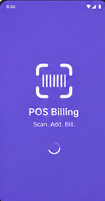
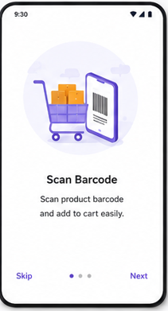
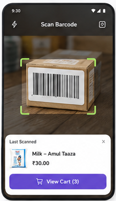
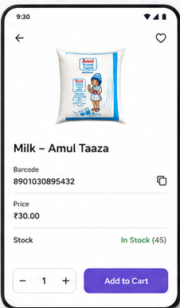
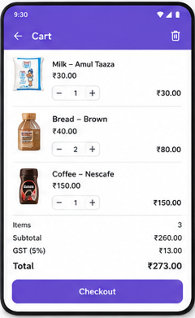
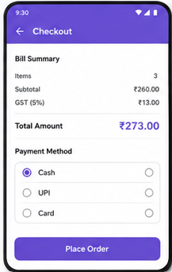

# SmartPOS - Modern Android Billing Application

SmartPOS is a feature-rich, modern Android Point of Sale (POS) application designed for retail environments. It leverages cutting-edge Android technologies to provide a seamless scanning, inventory management, and checkout experience.

## 🚀 Features

- **Real-time Barcode Scanning**: Integrated CameraX and Google ML Kit for high-performance barcode detection.
- **Interactive Scanning UI**: Custom Canvas-based scanning overlay with a synchronized "red-bar" animation for a professional look and feel.
- **Product Management**: 
    - Add and update products on the fly.
    - Gallery integration for product photos with **URI permission persistence**, ensuring images remain accessible across app restarts.
- **Dynamic Cart System**: Add items via scanning or manual search, adjust quantities, and calculate real-time GST (5%) and totals.
- **Sales History**: A complete log of all transactions with invoice numbers and itemized breakdowns (including product thumbnails at the time of sale).
- **Payment Workflow**: Simulated checkout process with various payment methods (UPI, Cash, Card).
- **Smooth UX**: Splash screen, onboarding flow, and haptic feedback (vibrations) on successful scans.

## 🛠 Tech Stack

- **UI**: [Jetpack Compose](https://developer.android.com/jetpack/compose) - Fully declarative UI.
- **Language**: [Kotlin](https://kotlinlang.org/) (2.0+)
- **Architecture**: **Clean Architecture** with MVVM (Model-View-ViewModel).
- **Database**: [Room Persistence Library](https://developer.android.com/training/data-storage/room) - Local data storage with KSP support.
- **Image Loading**: [Coil](https://coil-kt.github.io/coil/) - Efficient image loading and caching.
- **Scanning**: [Google ML Kit Barcode Scanning](https://developers.google.com/ml-kit/vision/barcode-scanning) & [CameraX](https://developer.android.com/training/camerax).
- **Dependency Injection**: Manual DI (standard for small-to-medium projects to keep it lightweight).
- **Navigation**: [Jetpack Compose Navigation](https://developer.android.com/jetpack/compose/navigation).

## 🏗 Project Structure

```text
com.example.billingapp
├── data
│   ├── local (Room DB, DAOs, Entities)
│   └── repository (Repository implementations)
├── domain
│   ├── model (Domain Data Classes)
│   ├── repository (Repository Interfaces)
│   └── usecase (Business logic units)
├── ui
│   ├── navigation (Navigation Graph & Screen routes)
│   ├── screens (Compose UI Screens)
│   ├── theme (Material3 Theme configurations)
│   └── viewmodel (State management)
└── MainActivity.kt
```

## 📸 Screenshots

| Splash Screen | Startup Screen | Scanner Screen |
|:---:|:---:|:---:|
|  |  |  |

| Product Details | Cart Screen | Checkout Screen |
|:---:|:---:|:---:|
|  |  |  |

## 🚦 Getting Started

1. Clone the repository:
   ```bash
   git clone https://github.com/karthikdofficial1998-hub/SmartPOS.git
   ```
2. Open the project in **Android Studio (Ladybug or newer)**.
3. Build and Run on a physical device (recommended for camera features).

---

**Developed by Karthik** - *Showcasing Android Excellence.*
